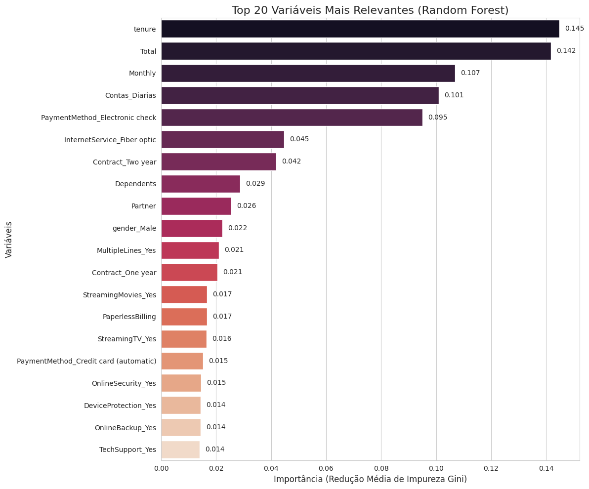
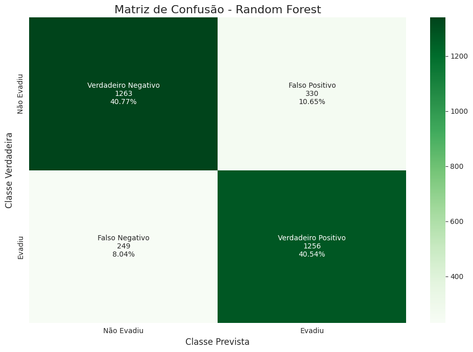

# Análise Preditiva de Churn em Telecom

**Autor:** Jhonatan

Este projeto analisa um conjunto de dados de uma empresa de telecomunicações para construir um modelo de machine learning capaz de prever a evasão de clientes (churn). O objetivo é identificar os fatores que mais contribuem para o churn e, a partir desses insights, propor estratégias de negócio focadas na retenção.

---

### Ferramentas e Tecnologias Utilizadas


---

### Análise e Resultados

A análise de dados e a modelagem permitiram identificar os fatores que mais influenciam a decisão de um cliente em deixar a empresa.

#### Fatores Mais Relevantes para Evasão (Churn)

O modelo **Random Forest**, que apresentou o melhor desempenho, apontou o **tempo de contrato (`tenure`)** como a variável mais importante para prever o churn. Outros fatores como o **gasto total (`Total`)**, a **mensalidade (`Monthly`)** e o **tipo de contrato** também se mostraram decisivos.

* **Fatores de Risco (Aumentam a chance de Churn):**
    * Contratos do tipo **Mês a Mês**.
    * Serviço de internet via **Fibra Ótica**.
    * Forma de pagamento por **Cheque Eletrônico**.

* **Fatores de Retenção (Diminuem a chance de Churn):**
    * Longo **tempo de contrato (`tenure`)**.
    * Contratos de **1 ou 2 anos**.
    * Assinatura de serviços de **Suporte Técnico** e **Segurança Online**.

*Gráfico com a importância de cada variável gerada pelo modelo Random Forest:*



#### Desempenho do Modelo Preditivo

Foram treinados e avaliados dois modelos: Regressão Logística (como baseline) e Random Forest. O modelo **Random Forest** foi superior em todas as métricas relevantes, com destaque para o **recall de 84%**, o que significa que ele foi capaz de **identificar corretamente 84 de cada 100 clientes que realmente iriam evadir**.

*Matriz de confusão do modelo Random Forest, visualizando os acertos e erros:*



---

### Estratégias de Retenção Recomendadas

Com base nos resultados, as seguintes estratégias de negócio são sugeridas:

1.  **Incentivar Contratos de Longo Prazo:** Oferecer descontos e benefícios para clientes com contrato "Mês a Mês" migrarem para planos anuais ou bianuais.
2.  **Programa de Fidelidade:** Recompensar clientes com muito tempo de casa (`tenure` alto) para reforçar a lealdade.
3.  **Atenção a Segmentos de Risco:** Criar ações proativas (ex: verificação de qualidade do serviço, oferta de novos métodos de pagamento) para o grupo de clientes com Fibra Ótica e pagamento via Cheque Eletrônico.

---

### Como Executar o Projeto

1.  Clone este repositório.
2.  Instale as dependências necessárias:
    ```bash
    pip install pandas scikit-learn imbalanced-learn seaborn matplotlib
    ```
3.  Abra o notebook `TelecomX_BR_Modelagem.ipynb` e execute as células em ordem.

---
